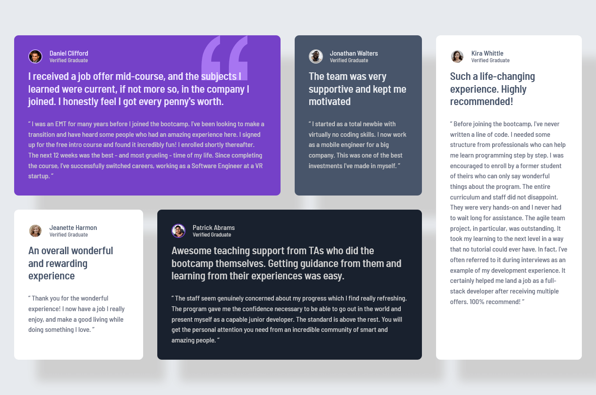

# Frontend Mentor - Testimonials grid section solution

This is a solution to the [Testimonials grid section challenge on Frontend Mentor](https://www.frontendmentor.io/challenges/testimonials-grid-section-Nnw6J7Un7). Frontend Mentor challenges help you improve your coding skills by building realistic projects.

## Table of contents

- [Overview](#overview)
  - [Screenshot](#screenshot)
  - [Links](#links)
- [My process](#my-process)
  - [Built with](#built-with)
  - [What I learned](#what-i-learned)
  - [Continued development](#continued-development)
- [Author](#author)

## Overview

### Screenshot



### Links

- Check out the solution code and implementation details on GitHub: [Solution URL](https://github.com/rafael-study-repo/testimonials-grid-section)
- You can view the live version of the project here: [Live Site URL](https://rafael-study-repo.github.io/testimonials-grid-section)

## My process

### Built with

- Semantic HTML5 markup
- CSS custom properties
- CSS Grid & Flexbox
- Git Conventional Commits
- CSS Media Queries

### What I learned

This project helped me improve my understanding of the following:

- **CSS Custom Properties:** Reinforced the use of CSS custom properties (variables) as modular options for changing styles

```css
.card--first {
  --bg-color-card: var(--purple-500);
  --border-color-image: var(--purple-300);
  --text-color: var(--grey-200);
  --title-color: var(--purple-50);
  --user-name-color: var(--purple-50);
  --user-status-color: var(--grey-200);
}
```

### Continued development

In the future, I plan to focus on:

- **Semantic HTML & Clean Code:** I want to further improve my HTML skills by ensuring that all pages are structured with semantic tags. This not only improves accessibility but also enhances SEO and the maintainability of my codebase.

- **Performance Optimization:** I'll focus on reducing page load times by optimizing images, using lazy loading, and improving the overall performance of my sites. Ensuring fast loading speeds is crucial for providing a better user experience.

- **Design & Accessibility:** I want to dive deeper into creating accessible websites. This includes ensuring proper color contrast, implementing ARIA roles, and making sure my websites are fully navigable with keyboard shortcuts for better inclusivity.

- **Security Best Practices:** I'll be exploring and implementing security best practices in my projects, such as preventing cross-site scripting (XSS) and ensuring secure data transmission through HTTPS.

## Author

- GitHub - [rafael-study-repo](https://github.com/rafael-study-repo)
- Frontend Mentor - [@rafael-study-repo](https://www.frontendmentor.io/profile/rafael-study-repo)
